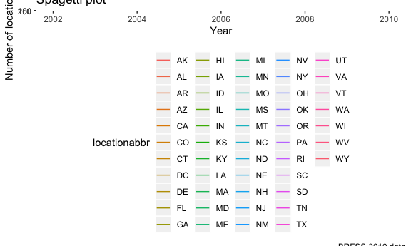
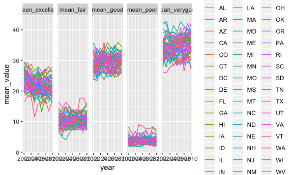
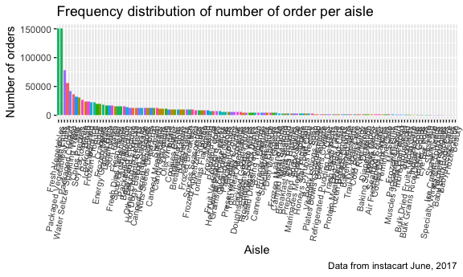
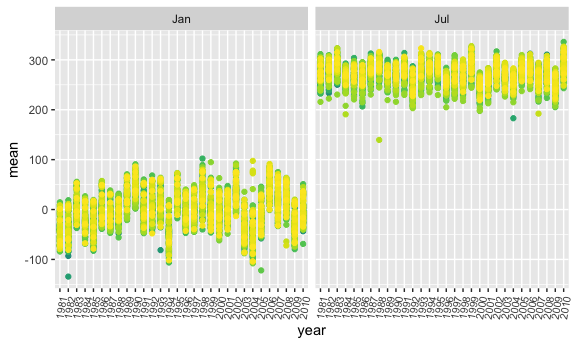
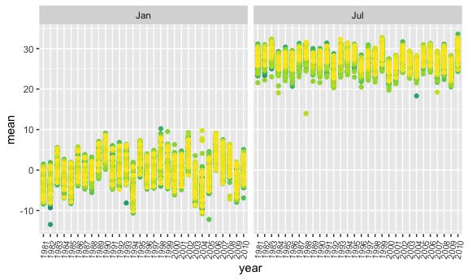

Homework 3
================
Amin Yakubu
10/10/2018

Setting some global options for my outputs

``` r
knitr::opts_chunk$set(
  fig.width = 6,
  fig.asp = .6,
  out.width = "90%"
)
```

Problem 1
---------

Loading the required libraries and data

``` r
library(tidyverse)
```

    ## ── Attaching packages ───────────────────────────────────────────────────────────────────────────────────────── tidyverse 1.2.1 ──

    ## ✔ ggplot2 3.0.0     ✔ purrr   0.2.5
    ## ✔ tibble  1.4.2     ✔ dplyr   0.7.6
    ## ✔ tidyr   0.8.1     ✔ stringr 1.3.1
    ## ✔ readr   1.1.1     ✔ forcats 0.3.0

    ## ── Conflicts ──────────────────────────────────────────────────────────────────────────────────────────── tidyverse_conflicts() ──
    ## ✖ dplyr::filter() masks stats::filter()
    ## ✖ dplyr::lag()    masks stats::lag()

``` r
library(p8105.datasets)
data(brfss_smart2010)
```

Some data cleaning

``` r
brfss_df = janitor::clean_names(dat = brfss_smart2010) %>% 
  filter(topic == "Overall Health") %>% 
  select(-(class:question), -sample_size, -(confidence_limit_low:geo_location)) %>% 
  mutate(response = forcats::fct_relevel(response, c("Excellent", "Very good", "Good", "Fair", "Poor")))
```

States that were observed at 7 locations

``` r
brfss_df %>% 
  filter(year == 2002) %>% 
  group_by(locationabbr) %>%
  distinct(locationdesc) %>% 
  summarise(n = n()) %>% 
  filter(n == 7) %>% 
  knitr::kable()
```

| locationabbr |    n|
|:-------------|----:|
| CT           |    7|
| FL           |    7|
| NC           |    7|

``` r
brfss_df %>% 
  group_by(locationabbr, year) %>% 
  summarise(number = n()) %>% 
  ggplot(aes(x = year, y = number, color = locationabbr)) +
  geom_line() +
  theme(legend.position = "bottom") +
  labs(
    title = "Spagetti plot",
    x = "Year",
    y = "Number of locations observed",
    caption = "BRFSS 2010 data"
  ) 
```



``` r
brfss_df %>% 
  filter(year %in% c(2002, 2006, 2010) & locationabbr == "NY") %>% 
  spread(key = response, value = data_value) %>% 
  janitor::clean_names() %>% 
  group_by(locationabbr, year) %>% 
  summarise( n = n(),
             mean = mean(excellent),
             sd = sd(excellent)) %>% 
  knitr::kable()
```

| locationabbr |  year|    n|      mean|        sd|
|:-------------|-----:|----:|---------:|---------:|
| NY           |  2002|    5|  24.04000|  4.486424|
| NY           |  2006|    6|  22.53333|  4.000833|
| NY           |  2010|    9|  22.70000|  3.567212|

For each year and state, I'm computing the average proportion in each response category and taking the average across locations in a state. Then making five-panel plot that shows, for each response category separately, the distribution of these state-level averages over time.

``` r
brfss_df %>% 
  spread(key = response, value = data_value) %>% 
  janitor::clean_names() %>% 
  group_by(locationabbr, year) %>% 
  summarise( n = n(),
             mean_excellent = mean(excellent, na.rm = TRUE),
             mean_verygood = mean(very_good, na.rm = TRUE),
             mean_good = mean(good, na.rm = TRUE),
             mean_fair = mean(fair, na.rm = TRUE),
             mean_poor = mean(poor, na.rm = TRUE)) %>% 
  gather(key = mean_variable, value = mean_value, mean_excellent:mean_poor) %>% 
  ggplot(aes(x = year, y = mean_value, color = locationabbr)) +
  geom_line() +
  facet_grid(~mean_variable) 
```



Problem 2
---------

Loading instacart dataset

``` r
data("instacart")
```

Finding the total number of aisles there are, and which aisles most items ordered from

``` r
instacart %>% 
  distinct(aisle_id) %>% 
  count()
```

    ## # A tibble: 1 x 1
    ##       n
    ##   <int>
    ## 1   134

``` r
instacart %>% 
  group_by(aisle_id, aisle) %>% 
  summarise(number = n()) %>% 
  ungroup() %>% 
  top_n(5, number) %>% 
  arrange(desc(number))
```

    ## # A tibble: 5 x 3
    ##   aisle_id aisle                      number
    ##      <int> <chr>                       <int>
    ## 1       83 fresh vegetables           150609
    ## 2       24 fresh fruits               150473
    ## 3      123 packaged vegetables fruits  78493
    ## 4      120 yogurt                      55240
    ## 5       21 packaged cheese             41699

Making a plot to show the number of items ordered in each aisle.

``` r
instacart %>% 
  group_by(aisle_id, aisle) %>% 
  summarise(number = n()) %>% 
  arrange(desc(number)) %>% 
  mutate(aisle = tools::toTitleCase(aisle)) %>% 
  ggplot(aes(x = reorder(aisle, -number), y = number, fill = aisle)) +
  geom_col() +
  theme(axis.text.x = element_text(angle = 80, hjust = 1, size = 8),
        legend.position = "none") +
  labs(
    title = "Frequency distribution of number of order per aisle",
    x = "Aisle",
    y = "Number of orders",
    caption = "Data from instacart June, 2017"
  )
```



I'm making a table to show the most popular item in aisles “baking ingredients”, “dog food care”, and “packaged vegetables fruits”

``` r
instacart %>% 
  select(aisle_id, aisle,product_id, product_name) %>% 
  filter( aisle == "baking ingredients" | aisle == "dog food care" | aisle == "packaged vegetables fruits") %>% 
  group_by(aisle, product_name) %>% 
  summarise(number = n()) %>% 
  top_n(5, number) %>% 
  arrange(desc(number))
```

    ## # A tibble: 15 x 3
    ## # Groups:   aisle [3]
    ##    aisle                   product_name                             number
    ##    <chr>                   <chr>                                     <int>
    ##  1 packaged vegetables fr… Organic Baby Spinach                       9784
    ##  2 packaged vegetables fr… Organic Raspberries                        5546
    ##  3 packaged vegetables fr… Organic Blueberries                        4966
    ##  4 packaged vegetables fr… Seedless Red Grapes                        4059
    ##  5 packaged vegetables fr… Organic Grape Tomatoes                     3823
    ##  6 baking ingredients      Light Brown Sugar                           499
    ##  7 baking ingredients      Pure Baking Soda                            387
    ##  8 baking ingredients      Cane Sugar                                  336
    ##  9 baking ingredients      Premium Pure Cane Granulated Sugar          329
    ## 10 baking ingredients      Organic Vanilla Extract                     327
    ## 11 dog food care           Snack Sticks Chicken & Rice Recipe Dog …     30
    ## 12 dog food care           Organix Chicken & Brown Rice Recipe          28
    ## 13 dog food care           Small Dog Biscuits                           26
    ## 14 dog food care           Standard Size Pet Waste bags                 25
    ## 15 dog food care           Organix Grain Free Chicken & Vegetable …     24

Make a table showing the mean hour of the day at which Pink Lady Apples and Coffee Ice Cream are ordered on each day of the week; format this table for human readers (i.e. produce a 2 x 7 table).

``` r
instacart %>% 
  filter(product_name == "Pink Lady Apples") %>% 
  group_by(order_dow, product_name) %>% 
  summarise(mean_hour = mean(order_hour_of_day))
```

    ## # A tibble: 7 x 3
    ## # Groups:   order_dow [?]
    ##   order_dow product_name     mean_hour
    ##       <int> <chr>                <dbl>
    ## 1         0 Pink Lady Apples      13.4
    ## 2         1 Pink Lady Apples      11.4
    ## 3         2 Pink Lady Apples      11.7
    ## 4         3 Pink Lady Apples      14.2
    ## 5         4 Pink Lady Apples      11.6
    ## 6         5 Pink Lady Apples      12.8
    ## 7         6 Pink Lady Apples      11.9

Problem 3
---------

``` r
data("ny_noaa")
```

Cleaning the data

``` r
noaa_df = ny_noaa %>% 
  mutate(month = months.Date(date, abbreviate = TRUE),
         day = chron::days(date),
         year = chron::years(date),
         quarter = quarters(date, abbreviate = FALSE),
         tmax = as.numeric(tmax))
```

Make a two-panel plot showing the average max temperature in January and in July in each station across years. Is there any observable / interpretable structure? Any outliers?

``` r
noaa_df %>% 
  group_by(id, year, month) %>% 
  summarize(n = n(),
            sum = sum(tmax, na.rm = TRUE),
            mean = mean(tmax, na.rm = TRUE)) %>% 
  filter(month %in% c("Jan", "Jul")) %>% 
  ggplot(aes(x = year, y = mean, color = id)) +
  facet_grid(~month) + 
  geom_point() +
  theme(legend.position = "none", 
        axis.text.x = element_text(angle = 80, hjust = 1, size = 8)) +
  viridis::scale_color_viridis(
    name = "Location", 
    discrete = TRUE) 
```

    ## Warning: Removed 5970 rows containing missing values (geom_point).



``` r
noaa_df %>% 
  filter(month %in% c("Jan", "Jul")) %>% 
  ggplot(aes(x = year, y = tmax, color = year)) +
  facet_grid(~month) +
  geom_boxplot() +
  theme(legend.position = "none", 
        axis.text.x = element_text(angle = 80, hjust = 1, size = 8))
```

    ## Warning: Removed 190331 rows containing non-finite values (stat_boxplot).

 \`\`\`

Make a two-panel plot showing (i) tmax vs tmin for the full dataset (note that a scatterplot may not be the best option); and (ii) make a plot showing the distribution of snowfall values greater than 0 and less than 100 separately by year.

``` r
scatter = ggplot(noaa_df, aes(x = tmin, y = tmax)) +
  geom_point(aes())

noaa_df %>% 
  filter(snow > 0 & snow < 100) %>% 
  ggplot(aes(x = year, y = snow, fill = year)) +
  geom_boxplot(alpha = 0.3) +
  theme(legend.position = "none", 
        axis.text.x = element_text(angle = 80, hjust = 1, size = 8))
```



``` r
density + scatter 
```

    ## NULL
