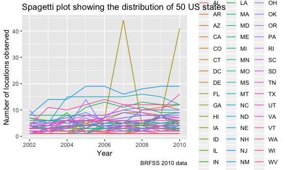

Homework 3
================
Amin Yakubu
10/10/2018

Loading the required libraries

``` r
library(tidyverse)
```

    ## ── Attaching packages ───────────────────────────────────────────────────────────────────────────────────────── tidyverse 1.2.1 ──

    ## ✔ ggplot2 3.0.0     ✔ purrr   0.2.5
    ## ✔ tibble  1.4.2     ✔ dplyr   0.7.6
    ## ✔ tidyr   0.8.1     ✔ stringr 1.3.1
    ## ✔ readr   1.1.1     ✔ forcats 0.3.0

    ## ── Conflicts ──────────────────────────────────────────────────────────────────────────────────────────── tidyverse_conflicts() ──
    ## ✖ dplyr::filter() masks stats::filter()
    ## ✖ dplyr::lag()    masks stats::lag()

``` r
library(p8105.datasets)
library(patchwork)
library(ggthemes)
library(hexbin)
```

Setting some global options for my outputs

``` r
knitr::opts_chunk$set(
  fig.width = 6,
  fig.asp = .6,
  out.width = "90%"
)
```

``` r
data(brfss_smart2010)
```

Problem 1
---------

Some data cleaning

``` r
brfss_df = janitor::clean_names(dat = brfss_smart2010) %>% 
  filter(topic == "Overall Health") %>% 
  select(-(class:question), -sample_size, -(confidence_limit_low:geo_location)) %>% 
  mutate(response = forcats::fct_relevel(response, c("Excellent", "Very good", "Good", "Fair", "Poor")))
```

States that were observed at 7 locations

``` r
brfss_df %>% 
  filter(year == 2002) %>% 
  group_by(locationabbr) %>%
  distinct(locationdesc) %>% 
  summarise(n = n()) %>% 
  filter(n == 7) %>% 
  knitr::kable()
```

| locationabbr |    n|
|:-------------|----:|
| CT           |    7|
| FL           |    7|
| NC           |    7|

In 2002, the states of CT, FL, NC were observed at 7 locations.

``` r
brfss_df %>% 
  distinct(locationabbr, locationdesc, year) %>% 
  group_by(locationabbr, year) %>% 
  summarise(number = n()) %>% 
  ggplot(aes(x = year, y = number, color = locationabbr)) +
  geom_line() +
  theme(legend.position = "bottom") +
  labs(
    title = "Spagetti plot",
    x = "Year",
    y = "Number of locations observed",
    caption = "BRFSS 2010 data"
  ) 
```



The code below shows a “spaghetti plot” that shows the number of locations in each state from 2002 to 2010. We see that there was a sudden increase in the number of locations for one of the states. The number of locations for majority of the states remained stable.

Making a table showing, for the years 2002, 2006, and 2010, the mean and standard deviation of the proportion of “Excellent” responses across locations in NY State.

``` r
brfss_df %>% 
  filter(year %in% c(2002, 2006, 2010) & locationabbr == "NY") %>% 
  spread(key = response, value = data_value) %>% 
  janitor::clean_names() %>% 
  group_by(locationabbr, year) %>% 
  summarise( n = n(),
             mean = mean(excellent),
             sd = sd(excellent)) %>% 
  knitr::kable()
```

| locationabbr |  year|    n|      mean|        sd|
|:-------------|-----:|----:|---------:|---------:|
| NY           |  2002|    5|  24.04000|  4.486424|
| NY           |  2006|    6|  22.53333|  4.000833|
| NY           |  2010|    9|  22.70000|  3.567212|

In the table, we see that the mean for proportion of excellent for the 2006 and 2010 are very similar and worse than 2002. The standard deviation are not very different for the years of 2002 and 2006.

For each year and state, I'm computing the average proportion in each response category and taking the average across locations in a state. Then making five-panel plot that shows, for each response category separately, the distribution of these state-level averages over time.

``` r
brfss_df %>% 
  spread(key = response, value = data_value) %>% 
  janitor::clean_names() %>% 
  group_by(locationabbr, year) %>% 
  summarise( n = n(),
             mean_excellent = mean(excellent, na.rm = TRUE),
             mean_verygood = mean(very_good, na.rm = TRUE),
             mean_good = mean(good, na.rm = TRUE),
             mean_fair = mean(fair, na.rm = TRUE),
             mean_poor = mean(poor, na.rm = TRUE)) %>% 
  gather(key = mean_variable, value = mean_value, mean_excellent:mean_poor) %>% 
  ggplot(aes(x = year, y = mean_value, color = locationabbr)) +
  geom_line() +
  facet_grid(~mean_variable) 
```


From the spagetti plot, we see that across the years, the highest mean is for the proportion of very good. The lowest mean is for the proportion of poor.

Problem 2
---------

Loading instacart dataset

``` r
data("instacart")
```

##### Short description of the dataset

The dataset contains 1384617 observations and 15 variables. The variable order\_id is a unique identifier of the orders that have been made. We see that there are 131209 unique orders. Variables department\_name, product\_name, and aisle have their corresponding unique identifiers. There are variables that describe time as well. order\_dow represents the day of the week the order was made and the order\_hour\_of\_day represents the time the hour the day. There are 131209 unique customers.

#### Finding the total number of aisles there are, and which aisles most items ordered from

``` r
instacart %>% 
  distinct(aisle_id) %>% 
  count()
```

    ## # A tibble: 1 x 1
    ##       n
    ##   <int>
    ## 1   134

``` r
instacart %>% 
  group_by(aisle_id, aisle) %>% 
  summarise(number = n()) %>% 
  ungroup() %>% 
  top_n(5, number) %>% 
  arrange(desc(number)) %>% 
  knitr::kable()
```

|  aisle\_id| aisle                      |  number|
|----------:|:---------------------------|-------:|
|         83| fresh vegetables           |  150609|
|         24| fresh fruits               |  150473|
|        123| packaged vegetables fruits |   78493|
|        120| yogurt                     |   55240|
|         21| packaged cheese            |   41699|

We see that there are 134 aisles. In the table above, we see that the top five most popular aisles with the top being fresh vegetables aisles.

Here, I'm making a plot to show the number of items ordered in each aisle.

``` r
instacart %>% 
  group_by(aisle_id, aisle) %>% 
  summarise(number = n()) %>% 
  arrange(desc(number)) %>% 
  mutate(aisle = tools::toTitleCase(aisle)) %>% 
  ggplot(aes(x = reorder(aisle, -number), y = number, fill = aisle)) +
  geom_col() +
  theme(axis.text.x = element_text(angle = 80, hjust = 1, size = 8),
        legend.position = "none") +
  labs(
    title = "Frequency distribution of number of order per aisle",
    x = "Aisle",
    y = "Number of orders",
    caption = "Data from instacart June, 2017"
  )
```


Again from the plot we see that fresh vegetables aisle is where the most orders come from.

I'm making a table to show the most popular item in aisles “baking ingredients”, “dog food care”, and “packaged vegetables fruits”

``` r
instacart %>% 
  select(aisle_id, aisle,product_id, product_name) %>% 
  filter( aisle == "baking ingredients" | aisle == "dog food care" | aisle == "packaged vegetables fruits") %>% 
  group_by(aisle, product_name) %>% 
  summarise(number = n()) %>% 
  top_n(1, number) %>% 
  arrange(desc(number)) %>% 
  knitr::kable()
```

| aisle                      | product\_name                                 |  number|
|:---------------------------|:----------------------------------------------|-------:|
| packaged vegetables fruits | Organic Baby Spinach                          |    9784|
| baking ingredients         | Light Brown Sugar                             |     499|
| dog food care              | Snack Sticks Chicken & Rice Recipe Dog Treats |      30|

The table show the top items for each of those aisles.

Next, I am making a table showing the mean hour of the day at which Pink Lady Apples and Coffee Ice Cream are ordered on each day of the week; format this table for human readers (i.e. produce a 2 x 7 table).

``` r
instacart %>% 
  filter(product_name == "Pink Lady Apples" ) %>% 
  group_by(order_dow, product_name) %>% 
  summarise(mean_hour = mean(order_hour_of_day)) %>% 
  spread(key = product_name, value = mean_hour) %>% 
  knitr::kable()
```

|  order\_dow|  Pink Lady Apples|
|-----------:|-----------------:|
|           0|          13.44118|
|           1|          11.36000|
|           2|          11.70213|
|           3|          14.25000|
|           4|          11.55172|
|           5|          12.78431|
|           6|          11.93750|

``` r
instacart %>% 
  filter(product_name == "Coffee Ice Cream" ) %>% 
  group_by(order_dow, product_name) %>% 
  summarise(mean_hour = mean(order_hour_of_day)) %>% 
  spread(key = product_name, value = mean_hour) %>% 
  knitr::kable()
```

|  order\_dow|  Coffee Ice Cream|
|-----------:|-----------------:|
|           0|          13.77419|
|           1|          14.31579|
|           2|          15.38095|
|           3|          15.31818|
|           4|          15.21739|
|           5|          12.26316|
|           6|          13.83333|

Problem 3
---------

``` r
data("ny_noaa")
```

Cleaning the data. Also, since temperature, precipitation, and snowfall are given in 10th of their units, we will just divide by 10 to have appropriate units. I'm creating the day, year, month variables as well.

``` r
noaa_df = ny_noaa %>% 
  mutate(month = months.Date(date, abbreviate = TRUE),
         day = chron::days(date),
         year = chron::years(date),
         tmax = (as.numeric(tmax))/10,
         tmin = (as.numeric(tmin))/10,
         prcp = prcp/10)
```

The dataset contains 2595176 observations and 10 variables. The dataset has variables that contain information on precipitation (prcp), maximum and minimum temperature (tmax and tmin) and snow fall(snow) and snow depth (snwd). There are 747 unique stations recording various weather information from 1981 to 2010.

``` r
noaa_df %>% 
  group_by(snow) %>% 
  summarise(number = n()) %>% 
  arrange(desc(number))
```

    ## # A tibble: 282 x 2
    ##     snow  number
    ##    <int>   <int>
    ##  1     0 2008508
    ##  2    NA  381221
    ##  3    25   31022
    ##  4    13   23095
    ##  5    51   18274
    ##  6    76   10173
    ##  7     8    9962
    ##  8     5    9748
    ##  9    38    9197
    ## 10     3    8790
    ## # ... with 272 more rows

For snowfall, the most common observed values are 0 and NA. This is because it doesn't snow on majority of the days in a year and also there might be stations that aren't recording snowfall because their geographic location may not have snow fall at all.

Making a two-panel plot showing the average max temperature in January and in July in each station across years.

``` r
noaa_df %>% 
  group_by(id, year, month) %>% 
  summarize(n = n(),
            sum = sum(tmax, na.rm = TRUE),
            mean = mean(tmax, na.rm = TRUE)) %>% 
  filter(month %in% c("Jan", "Jul")) %>% 
  ggplot(aes(x = year, y = mean, color = id)) +
  facet_grid(~month) + 
  geom_point() +
  theme(legend.position = "none", 
        axis.text.x = element_text(angle = 80, hjust = 1, size = 8)) +
  viridis::scale_color_viridis(
    name = "Location", 
    discrete = TRUE) 
```

    ## Warning: Removed 5970 rows containing missing values (geom_point).


Looking at the general structure, we see that there are higher temperatures in July as compared to January, as we would expect. There are a few outliers in some years.

The plot below show the average temperature for all stations over the years for January and July.

``` r
noaa_df %>% 
  filter(month %in% c("Jan", "Jul")) %>% 
  ggplot(aes(x = year, y = tmax, color = year)) +
  facet_grid(~month) +
  geom_boxplot() +
  theme(legend.position = "none", 
        axis.text.x = element_text(angle = 80, hjust = 1, size = 8))
```

    ## Warning: Removed 190331 rows containing non-finite values (stat_boxplot).


I'm making a two-panel plot showing (i) tmax vs tmin for the full dataset (note that a scatterplot may not be the best option); and (ii) make a plot showing the distribution of snowfall values greater than 0 and less than 100 separately by year.

``` r
my_hex = ggplot(noaa_df, aes(x = tmin, y = tmax)) +
  geom_hex(aes()) +
  theme(legend.position = "left")
        
my_boxes = noaa_df %>% 
  filter(snow > 0 & snow < 100) %>% 
  ggplot(aes(x = year, y = snow, fill = year)) +
  geom_boxplot(alpha = 0.3) +
  theme(legend.position = "none", 
        axis.text.x = element_text(angle = 80, hjust = 1, size = 8))

my_hex / my_boxes
```

    ## Warning: Removed 1136276 rows containing non-finite values (stat_binhex).


The hexagonal heat map show the distribution (count) of the pairs of tmax and tmin. From the box plot, we see that there are more variability in snowfall in the last ten years compared to first ten years. Also there are a lot more outliers in the last ten years.
